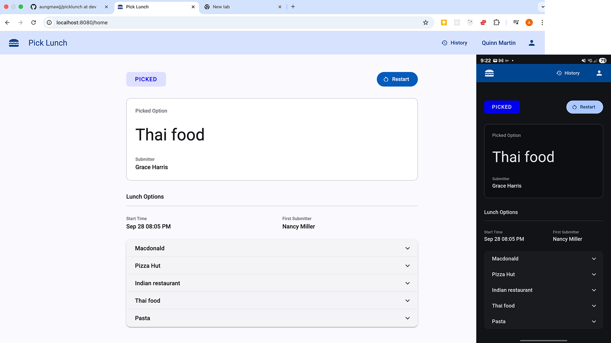

# Pick Lunch

There is frequently a need for teams to collectively decide on a location to head to for lunch. While each team member has an idea in mind, not everyone gets heard in the commotion and much time is spent to arrive at what may as well be a random choice.

This mini project solve this problem by developing a web based application.



## Requirements

1. The application has a web page that allows a user to input a restaurant of their choice,
   which is submitted to a backend service via an API call.

2. The backend service has an API that returns a random restaurant from the submitted choices.

3. Other users may submit restaurants of their choice as well.

4. The web page allows a user to request for a random choice based on the submitted choices.
   After the random choice is shown, no further restaurants may be submitted.

5. Multiple users may initiate different sessions and invite guests to submit choices to their session.
   These choices are limited only to the initiated session.

6. A list of pre-defined user will be loaded upon program startup.
   Only these users are allowed to initiate a session as per task 5.

7. Only the user who submitted the first restaurant may make the request in task 4.

8. Ensure the program can be compiled and run on any machine through some form of automation.

## User management

A list of authorized will be loaded to the system on startup from `users.csv` file by default.
The file includes user entries with fields for username, display name and bcrypt encoded password.
For test purpose, 20 users are available in the default users.csv file using `pw` as password.

## Build and Run

This project can be build and run by using Docker or directly using Node.js and Java.

### Run using the prebuilt docker image

Make sure `docker` is available on your computer.

Run the app
```bash
docker run --name picklunch -p 8080:8080 aungmaw/picklunch
```

### Build and run using docker

```bash
git clone https://github.com/aungmawjj/picklunch.git

# go into the project folder
cd picklunch
```

Build docker image.

```bash
# at the project root folder
docker build -t aungmaw/picklunch .
```

Run the app with on-memory database.

```bash
docker run --name picklunch -p 8080:8080 aungmaw/picklunch
```

You can access the web app at http://localhost:8080.

You can also start the app with postgres database. In that case the app data will not be lost across restarts.

Start the app
```bash
docker compose up -d
```

To stop
```bash
docker compose down
```

### Using Node.js and Java

Make sure `Node.js` (^20.19.0 || ^22.12.0 || ^24.0.0) and `Java` (^17) is available on your computer.

Build spring boot

On unix
```bash
./mvnw clean package
```

On windows
```bash
mvnw.cmd clean package
```

Build webapp

```bash
cd webapp
npm install
npm run build
```

Run the app

```bash
java -jar target/picklunch-1.0.0.jar
```

## Usage

- When the app is started, any authorized user can start a lunch picker session with a selected wait time.
- After that, all authorized user can submit a lunch option.
- The first submitter can request to pick a random option
  when all users submitted their options or the wait time is over.

The API docs can be accessed at http://localhost:8080/swagger-ui/index.html.
